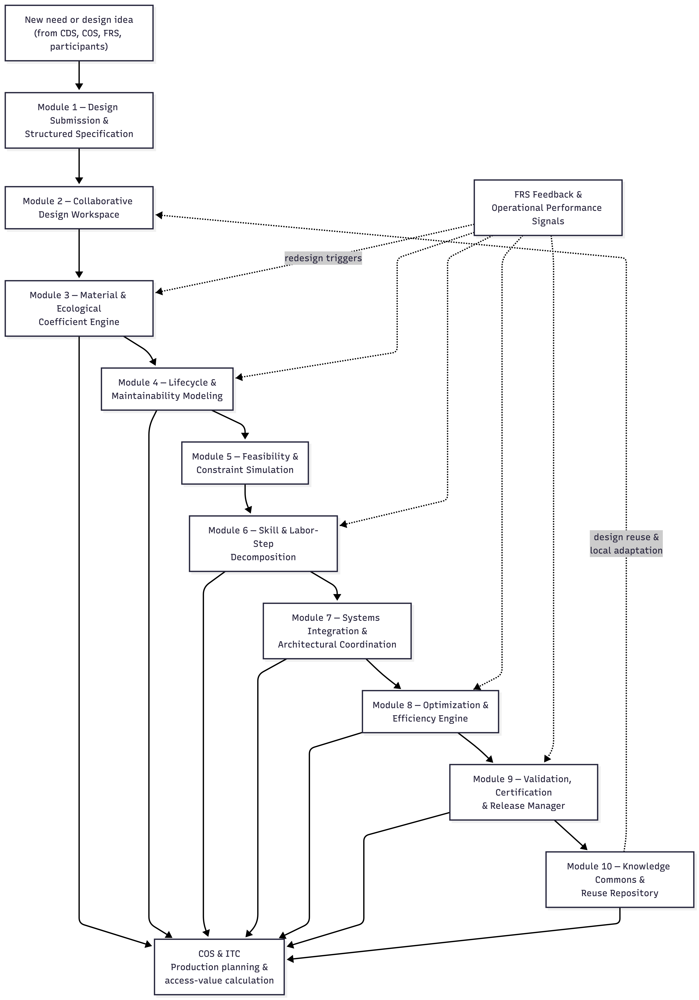

# Assets Directory

This directory stores **non-text resources** referenced throughout the Integral whitepaper and subsystem modules.

Assets may include:

- diagrams
- system maps
- architectural illustrations
- figures used in explanations
- visualizations supporting mathematical sketches
- images embedded in markdown files

---

## Usage Guidelines

### 1. Reference Only
Assets should support documentation.  
They should not exist without being referenced by at least one markdown file.

---

### 2. Naming Convention

Use descriptive, stable filenames:

- lowercase
- hyphen-separated
- versioned when necessary

Example:
```
integral-system-diagram-12.png
```

---

### 3. Linking From Markdown

Assets are referenced using **relative paths**.

Example (from whitepaper file):

```

```

Paths will vary depending on directory depth.

---

### 4. Versioning Philosophy

Avoid overwriting diagrams with semantic meaning.

Instead:
- create new versions when diagrams materially change
- keep historical versions for traceability

---

### 5. File Types

Recommended formats:

- PNG (diagrams)
- SVG (vector graphics)
- JPG (photographic imagery)
- GIF (simple animations)

Avoid proprietary formats where possible.

---

## Future Evolution

As the project grows, this directory may expand into structured subfolders such as:

- diagrams/
- simulations/
- figures/
- animation-exports/

This structure will be introduced only when scale demands it.
